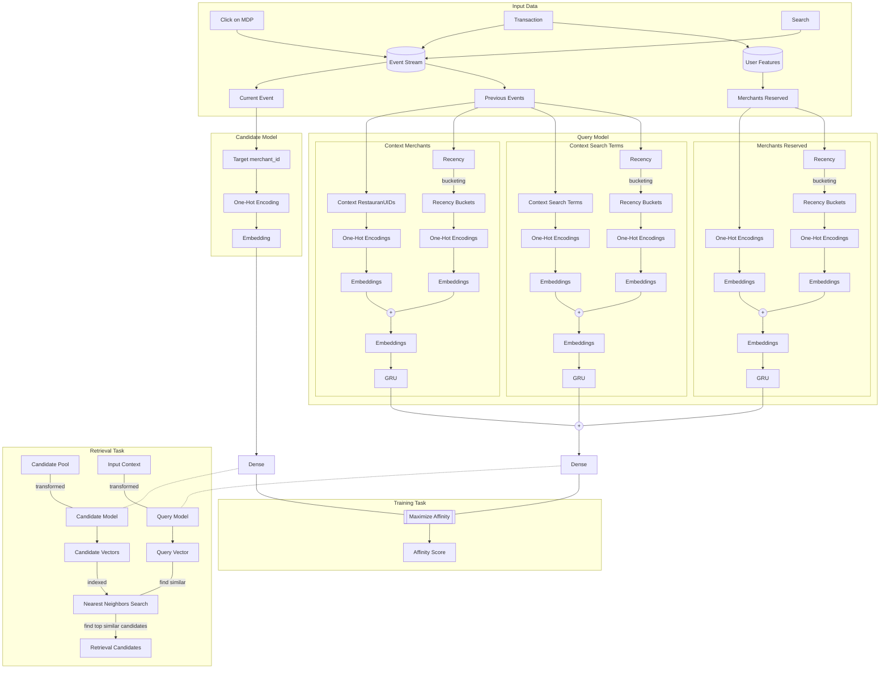

```mermaid
graph TD
    subgraph Input [Input Data]
        EventMDP[Click on MDP] --> EventStream[(Event Stream)]
        EventTxn[Transaction] --> EventStream
        EventSearch[Search] --> EventStream[(Event Stream)]
        EventTxn[Transaction] --> UserFeatures[(User Features)]
        EventStream --> CurrentEvent[Current Event]
        EventStream --> PreviousEvents[Previous Events]
        UserFeatures --> MerchantsReserved[Merchants Reserved]
        end

    subgraph Candidate [Candidate Model]
        CurrentEvent --> TargetRUID[Target merchant_id]
        TargetRUID --> CandidateOneHot[One-Hot Encoding]
        CandidateOneHot --> CandidateEmbedding[Embedding]
        end

    subgraph Query [Query Model]
        subgraph ContextRUIDsFeatures [Context Merchants]
            PreviousEvents --> ContextRUIDs[Context RestauranUIDs]
            ContextRUIDs --> ContextRUIDsOneHot[One-Hot Encodings]
            ContextRUIDsOneHot --> ContextRUIDsEmbedding[Embeddings]

            PreviousEvents --> ContextRUIDsRecency[Recency]
            ContextRUIDsRecency --> |bucketing| ContextRUIDsRecencyBucket[Recency Buckets]
            ContextRUIDsRecencyBucket --> ContextRUIDsRecencyOneHot[One-Hot Encodings]
            ContextRUIDsRecencyOneHot --> ContextRUIDsRecencyEmbedding[Embeddings]

            ContextRUIDsEmbedding --- ContextRUIDsConcatenate((+))
            ContextRUIDsRecencyEmbedding --- ContextRUIDsConcatenate
            ContextRUIDsConcatenate --> ContextRUIDsConcatEmbedding[Embeddings]
            ContextRUIDsConcatEmbedding --> ContextRUIDsGRU[GRU]
            end

        subgraph ContextSearchTermsFeatures [Context Search Terms]
            PreviousEvents --> ContextSearchTerms[Context Search Terms]
            ContextSearchTerms --> ContextSearchTermsOneHot[One-Hot Encodings]
            ContextSearchTermsOneHot --> ContextSearchTermsEmbedding[Embeddings]

            PreviousEvents --> ContextSearchTermsRecency[Recency]
            ContextSearchTermsRecency --> |bucketing| ContextSearchTermsRecencyBucket[Recency Buckets]
            ContextSearchTermsRecencyBucket --> ContextSearchTermsRecencyOneHot[One-Hot Encodings]
            ContextSearchTermsRecencyOneHot --> ContextSearchTermsRecencyEmbedding[Embeddings]

            ContextSearchTermsEmbedding --- ContextSearchTermsConcatenate((+))
            ContextSearchTermsRecencyEmbedding --- ContextSearchTermsConcatenate
            ContextSearchTermsConcatenate --> ContextSearchTermsConcatEmbedding[Embeddings]
            ContextSearchTermsConcatEmbedding --> ContextSearchTermsGRU[GRU]
            end

        subgraph MerchantsReservedFeatures [Merchants Reserved]
            MerchantsReserved --> MerchantsReservedOneHot[One-Hot Encodings]
            MerchantsReservedOneHot --> MerchantsReservedEmbedding[Embeddings]

            MerchantsReserved --> MerchantsReservedRecency[Recency]
            MerchantsReservedRecency --> |bucketing| MerchantsReservedRecencyBucket[Recency Buckets]
            MerchantsReservedRecencyBucket --> MerchantsReservedRecencyOneHot[One-Hot Encodings]
            MerchantsReservedRecencyOneHot --> MerchantsReservedRecencyEmbedding[Embeddings]

            MerchantsReservedEmbedding --- MerchantsReservedConcatenate((+))
            MerchantsReservedRecencyEmbedding --- MerchantsReservedConcatenate
            MerchantsReservedConcatenate --> MerchantsReservedConcatEmbedding[Embeddings]
            MerchantsReservedConcatEmbedding --> MerchantsReservedGRU[GRU]
            end
        end

    ContextRUIDsGRU --- QueryConcat((+))
    ContextSearchTermsGRU --- QueryConcat((+))
    MerchantsReservedGRU --- QueryConcat((+))

    QueryConcat --> QueryDense[Dense]
    CandidateEmbedding --> CandidateDense[Dense]

    QueryDense --- Loss[[Maximize Affinity]]
    CandidateDense --- Loss

    QueryDense -.- QueryModel
    CandidateDense -.- CandidateModel

    subgraph TrainingTask[Training Task]
        Loss --> AffinityScore[Affinity Score]
        end

    subgraph RetrievalTask[Retrieval Task]
        CandidatePool[Candidate Pool] --- |transformed| CandidateModel[Candidate Model] --> CandidateVectors[Candidate Vectors] --> |indexed| Indexer[Nearest Neighbors Search]
        InputContext[Input Context] --- |transformed| QueryModel[Query Model] --> QueryVector[Query Vector]
        QueryVector --- |find similar| Indexer --> |find top similar candidates| RetrievalCandidates[Retrieval Candidates]
        end
```
